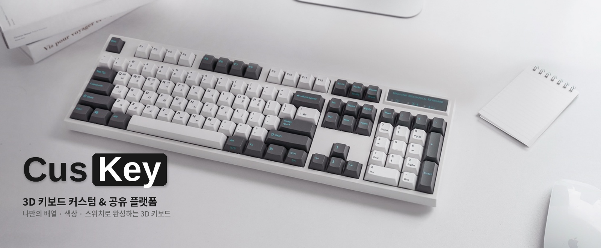
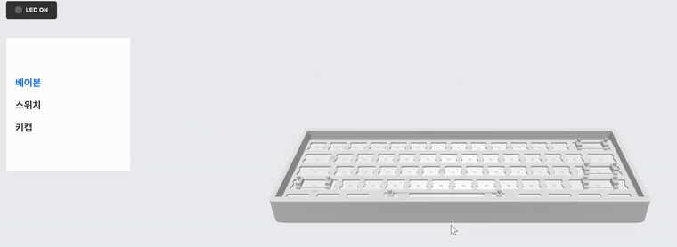
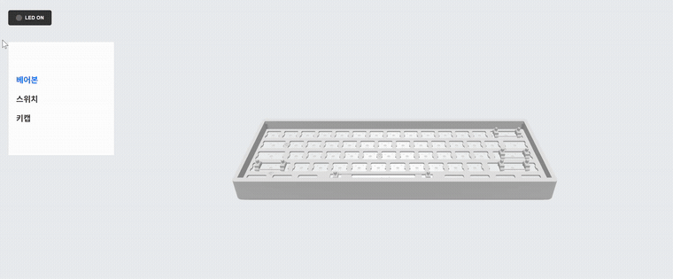
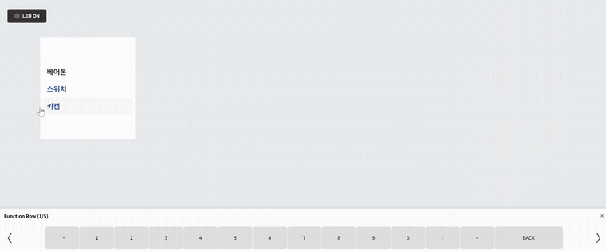

# ⌨️ CusKey

<p align="center">
  
</p>

## 프로젝트 소개

CusKey는 60% / 80% / 100% 배열의 키보드를 3D로 조립해보고, 베어본·스위치·키캡 색상을 직접 커스터마이징할 수 있는 웹 서비스입니다.

- 키보드 크기를 선택하면 파츠가 하나씩 조립되는 3D 애니메이션을 볼 수 있습니다.
- 색 조합이 잘 안 떠오를 때는 AI 색상 추천을 받아볼 수 있습니다.
- 완성한 키보드는 저장하거나 다른 사용자와 공유할 수 있고, 다른 사람이 올린 키보드에 좋아요를 남길 수 있습니다.
- 이메일 또는 카카오 로그인으로 가입하고, 마이페이지에서 내 정보와 만든 키보드를 관리합니다.

## 👥 팀원

<table>
  <tr>
    <th>현지훈</th>
    <th>염정규</th>
    <th>김호연</th>
    <th>조우주</th>
  </tr>
  <tr>
    <td></td>
    <td></td>
    <td></td>
    <td></td>
  </tr>
  <tr>
    <td><a href="https://github.com/jihun8861">@jihun8861</a></td>
    <td><a href="https://github.com/Yeom1009">@Yeom1009</a></td>
    <td><a href="https://github.com/Hopar7">@Hopar7</a></td>
    <td><a href="https://github.com/wooju8303">@wooju8303</a></td>
  </tr>
</table>

## ✨ 주요 기능

### 3D 키보드 커스터마이징

`@react-three/fiber`로 만든 3D 씬에서 베어본 케이스 → PCB → 스위치 → 키캡 순으로 조립되는 애니메이션을 보여줍니다. 키캡은 행(row) 단위로 넘겨가며 원하는 키만 골라 색을 바꿀 수 있고(`react-colorful` 컬러 피커 사용), LED on/off, 카메라 리셋 같은 기능도 있습니다. 완성한 디자인은 정해진 카메라 각도에서 스크린샷으로 저장됩니다.

<table>
  <tr>
    <th align="center">베어본 조립</th>
    <th align="center">스위치 선택</th>
    <th align="center">키캡 색상 지정</th>
  </tr>
  <tr>
    <td></td>
    <td></td>
    <td></td>
  </tr>
</table>

### AI 색상 추천

현재 선택한 색상 조합을 기준으로 OpenAI(GPT-4o)가 어울리는 베어본/스위치/키캡 조합과 설명을 추천해줍니다.

### 저장 & 공유

만든 키보드를 개인 저장소에 저장하거나, 다른 사용자에게 공유할 수 있습니다. 공유된 키보드는 썸네일과 함께 목록에 노출되고, 좋아요를 누르면 마이페이지 관심목록에서 다시 볼 수 있습니다.

### 회원 인증

이메일 회원가입/로그인과 카카오 소셜 로그인을 지원합니다. 로그인하면 서버에서 JWT를 발급하고, 이후 요청마다 이 토큰으로 사용자 정보를 확인합니다. 로그인 상태는 Zustand(`useAuthStore`)로 전역 관리합니다.

### 마이페이지

닉네임/비밀번호 변경, 내가 만든 커스텀 키보드 목록, 좋아요 누른 키보드(관심목록)를 확인할 수 있습니다.

## 기술 스택

### Frontend

| 분야 | 기술 |
|---|---|
| Framework | React (Vite), React Router |
| 3D 렌더링 | Three.js, @react-three/fiber, @react-three/drei, @react-three/postprocessing |
| 상태 관리 | Zustand |
| 스타일링 | styled-components, framer-motion |
| HTTP 통신 | Axios, Fetch API |
| 기타 | react-colorful (컬러 피커), react-icons |

### Backend

| 분야 | 기술 |
|---|---|
| Language / Framework | Java 17, Spring Boot 3.3.1 |
| 인증 / 보안 | Spring Security, JWT (jjwt) |
| 데이터 접근 | Spring Data JPA, PostgreSQL |
| AI 연동 | Spring AI (OpenAI GPT-4o) |
| 파일 저장소 | Firebase Admin SDK (Firebase Storage) |
| 외부 연동 | 카카오 소셜 로그인 API |
| API 문서화 | Springdoc OpenAPI (Swagger) |

## 아키텍처 & 인증 흐름

```
[Browser]
   │  로그인 요청 (이메일 or 카카오)
   ▼
[Spring Boot]
   │  MemberService / KakaoService에서 인증 처리
   │  JwtTokenProvider가 JWT 발급
   ▼
[Frontend]
   │  발급받은 JWT를 localStorage에 저장
   │  이후 모든 요청 시 토큰을 서버로 전달
   ▼
[Spring Boot: /findbodybytoken]
   │  JwtTokenProvider가 토큰을 복호화해 사용자 정보 반환
   ▼
[Zustand: useAuthStore]
   └─ 전역 상태(user)로 저장 → Header/Profile 등 전역에서 로그인 상태 참조
```

```
[3D 커스터마이징 흐름]

CustomPage (크기 선택: 60% / 80% / 100%)
   │
   ▼
ThreeDModel (Canvas) ─┬─ KeyboardPart × N  (케이스 / PCB / 스위치 / 키캡 개별 GLB 로드)
                       ├─ KeyboardOrbitControls (카메라 컨트롤)
                       ├─ ShadowLimiter (그림자 최적화)
                       └─ ScreenshotHandler (완성 이미지 캡처)
   │
   ├─ KeycapArray → 키캡별 색상 지정 → ThreeDModel에 실시간 반영
   ├─ Recommendate → AI 추천 결과 표시
   └─ saveItem / shareItem → 백엔드로 완성 데이터 + 이미지 전송
```

설계에서 신경 쓴 부분:

- 60% / 80% / 100% 배열별 파츠 좌표, 키 레이아웃, 키캡 ID를 데이터 파일(`KeyboardPositions`, `KeyboardLayout`, `KeycapID`)로 분리해서 크기가 바뀌어도 로직을 그대로 재사용합니다.
- 키캡 색상은 프론트에서 문자열(전체 통일) 또는 객체(키별 개별 지정) 두 형태로 올 수 있는데, 백엔드에서는 `FlexibleInputDeserializer`로 둘 다 유연하게 파싱합니다.
- 이미지는 Firebase Storage에 업로드하고, 다운로드 토큰이 포함된 URL을 DB에 저장하는 방식을 씁니다.

## 프로젝트 구조

### Frontend

```
src/
├── api/              # API 요청 함수 및 인증 스토어
├── components/
│   ├── home/           # 메인페이지 섹션
│   ├── model/           # 3D 모델 렌더링
│   └── modal/            # 공용 모달
├── data/              # 키보드 레이아웃 / 좌표 / 키캡 ID / 스위치 데이터
├── layouts/            # Header, Footer, ScrollToTop, ChatBot
├── pages/
│   ├── login/            # 로그인 / 회원가입 / 카카오 리다이렉트
│   ├── main/             # 메인페이지, 마이페이지
│   ├── mypage/            # 회원정보 수정, 나의 키보드, 관심목록
│   └── custom/            # 커스텀 제작 페이지, 3D 뷰어
└── routes/            # 라우팅 설정
```

### Backend

```
src/main/java/com/ho/edcustom/
├── Config/            # Security, CORS/Interceptor, Swagger, Multipart 설정
├── controller/          # REST API 엔드포인트
├── service/            # 비즈니스 로직
├── repository/           # JPA Repository
├── entity/            # DB 엔티티
├── DTO/               # 요청 / 응답 DTO
├── Jwt/               # JWT 발급 / 검증
├── Interceptor/         # 요청 로깅
├── Initializer/          # Firebase 초기화
├── Deserializer/         # 키캡 색상 유연 파싱용 커스텀 역직렬화
└── enumSet/            # 공통 에러 코드
```
